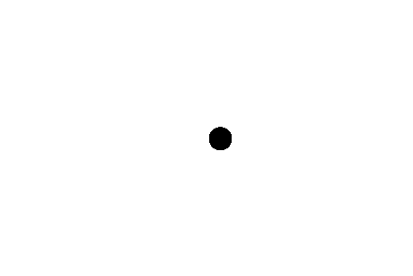

# photoshoot
Generate a GIF of canon balls that shoot around and slowly fall in place to form an image.

The project is inspired by [this video](https://youtu.be/lS_qeBy3aQI?si=0QOkNiy3eRM54eK1) (especially the end).

In the current state, `photoshoot` is completely unoptimizied and slow.
Often it hangs in the end but I also had some really good results after tuning the settings.

# usage
```console
$ photoshoot --output out.gif some-photo.jpg
$ photoshoot --help
Usage: photoshoot [OPTIONS] --output <OUTPUT> <PHOTO>

Arguments:
  <PHOTO>  Path to the input photo

Options:
  -o, --output <OUTPUT>          Path to the output GIF
  -f, --frame-rate <FRAME_RATE>  Frame rate of the GIF [default: 0.02]
      --gif-speed <GIF_SPEED>    Speed of the writing of the GIF [default: 10]
  -s, --substeps <SUBSTEPS>      Simulation substeps [default: 5]
      --gravity <GRAVITY>        Simulation gravity [default: 9.81]
  -r, --radius <RADIUS>          Radius of the canon balls [default: 1]
  -b, --black-bg                 Black background (default: white)
  -i, --infinite                 Should the GIF run repeat infinitely
  -l, --last-frame <LAST_FRAME>  How much longer should the last frame be [default: 50]
      --dry-run                  Don't write to file
  -h, --help                     Print help
  -V, --version                  Print version
```

## little showcase
 (from [rusteacean.net](https://rusteacean.net))

